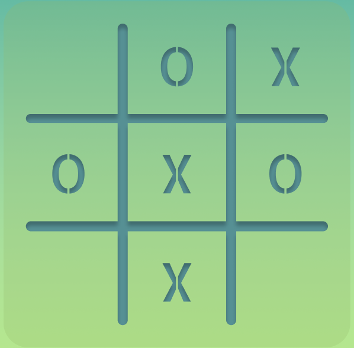
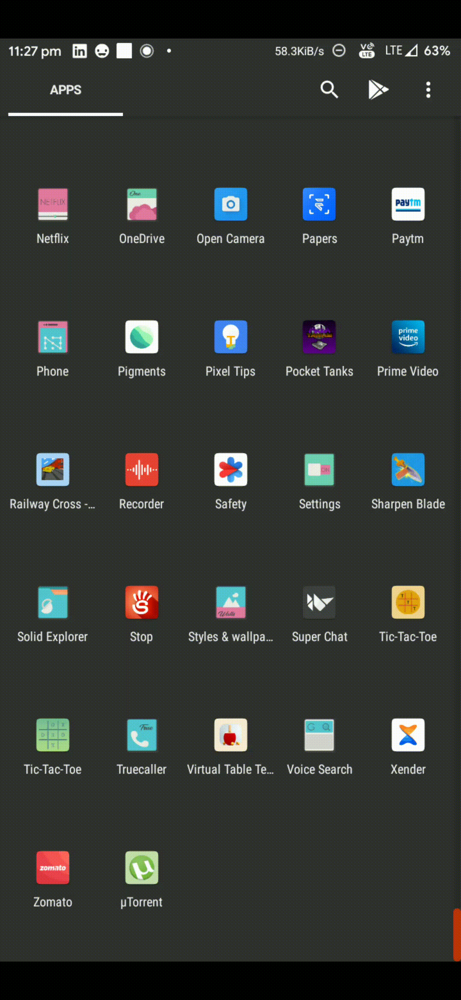

#  Kivy Tic-Tac-Toe Game
This app is a cross-platform Tic-Tac-Toe game which is completely developed using Python3 and kivy framework.

* The game is fully scalable and therfore can be used on multiple devices.
* The game has a VS computer mode.
* The game also has sounds effects.

## Demo

## Requirements

* Kivy > 2.0.0rc1 `pip3 install kivy==2.0.0rc1`
* KivyMD > 0.104.0 `pip3 install kivymd==0.104.0`
* pillow `pip3 install pillow`
* pyjnius `pip3 install pyjnius`

## Usage

APK File: `/bin/tictactoe-1.0-armeabi-v7a-debug.apk`

Python Code File: `main.py`

Python Game Code File: `game.py`

Kivy Lang Layout File: `main.kv`